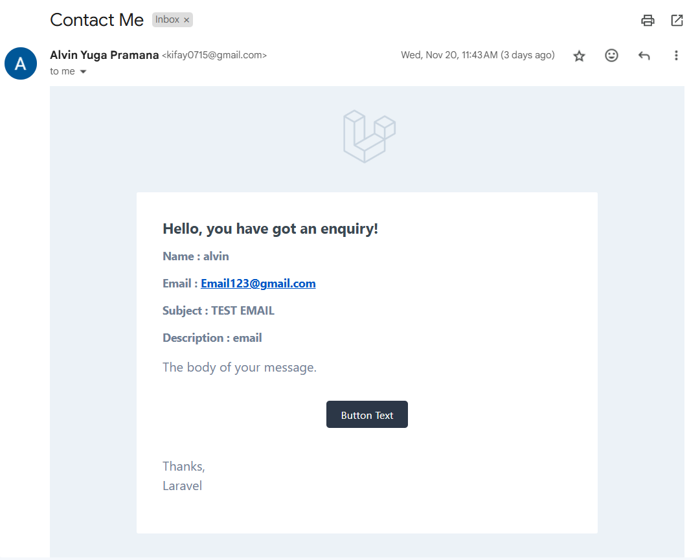

# Bigboss-Project

Bigboss-Project adalah website portfolio yang saya buat menggunakan **Laravel 11** sebagai framework utama. Website ini mencakup beberapa bagian penting, antara lain:
- **About**
- **Skills**
- **Projects**
- **Experience**
- **Contact Me**

Untuk membantu mempercantik tampilan, saya menggunakan **Bootstrap** sebagai framework CSS. Selain itu, saya juga menggunakan sedikit animasi dengan **JavaScript** untuk meningkatkan interaktivitas dan pengalaman pengguna.

## Fitur Utama

- **About**: Menampilkan informasi tentang diri saya.
- **Skills**: Menampilkan keterampilan dan keahlian yang saya miliki.
- **Projects**: Menampilkan proyek-proyek yang telah saya kerjakan beserta penjelasan singkat tentang masing-masing proyek.
- **Experience**: Menampilkan pengalaman kerja dan proyek yang relevan.
- **Contact Me**: Formulir yang memungkinkan pengunjung untuk mengirim pesan kepada saya melalui email.

## Teknologi yang Digunakan

Website ini dibangun menggunakan teknologi berikut:

- **Laravel 11**: Sebagai framework PHP untuk mengelola backend dan logika aplikasi.
- **Bootstrap**: Untuk membuat tampilan responsif dan antarmuka yang menarik.
- **JavaScript**: Digunakan untuk menambahkan animasi dan interaksi dinamis pada halaman.
- **SMTP (Gmail)**: Untuk mengirimkan email melalui formulir kontak. Saya menggunakan otentikasi username dan password untuk konfigurasi SMTP.

## Hosting

Saya berhasil melakukan **hosting** website portfolio saya di **Vercel**, sehingga website dapat diakses secara online melalui URL yang telah saya daftarkan. Anda dapat mengunjungi website saya di [URL Website](https://bigboss-project.vercel.app/).

## Refleksi

Sebelum website saya dideploy di Vercel, formulir **Contact Me** berfungsi dengan baik dan dapat mengirimkan email ke akun **Gmail** saya. Namun, setelah proses deploy, saya mengalami sedikit masalah. Meskipun pengaturan menggunakan **SMTP Gmail** dengan autentikasi username dan password, saya tidak bisa lagi menerima email dari formulir tersebut setelah deployment.

Berikut adalah bukti bahwa email dapat terkirim dengan baik sebelum deployment (screenshot akan dilampirkan di sini).

### Hasil Send Email:

### Tutorial yang Saya Ikuti
Saya telah menonton tutorial di YouTube untuk membuat SMTP Gmail menggunakan controller, sudah berhasil di local, namun ketika dihosting di vercel jadinya **419 Page Expired**. Berikut adalah link ke tutorial yang saya tonton:
- [Tutorial Membuat Pengiriman Email dengan SMTP Gmail - YouTube](https://youtu.be/GSIUAhmn9ks?si=JpKFsb14AXb5tAFI)

### Pengaturan SMTP yang Digunakan:
- **SMTP Host**: smtp.gmail.com
- **SMTP Port**: 587
- **SMTP Authentication**: Username dan password Gmail

## Pertanyaan

Apakah ada saran atau pendapat untuk mengatasi masalah ini? Mungkin ada pengaturan yang terlewat setelah deployment atau ada masalah lain terkait konfigurasi di Vercel? Saya akan sangat menghargai bantuan atau masukan dari komunitas untuk bisa menyelesaikan masalah ini.
